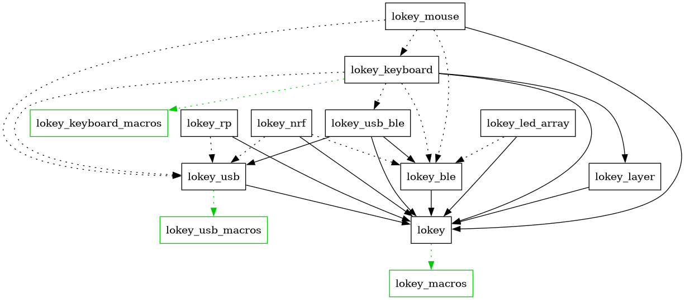

# Contributing to Lokey

Thanks for contributing! This project is a Rust firmware framework for input devices with multiple crates and embedded targets.

## Ways to contribute

- Fix bugs and improve reliability
- Add or refine features in the core crates
- Add support for boards
- Improve docs (website or API docs)
- Add examples

## Development setup

### Prerequisites

- Rust toolchain pinned in [rust-toolchain.toml](rust-toolchain.toml)

If you use [rustup](https://rustup.rs/), run the following command:

```sh
rustup toolchain install
```

If you use [Nix](https://nixos.org/), run the following command to create a shell that uses the Nix flake included in the repository:

```sh
nix develop
```

### Workspace overview

This repository is organized as a Cargo workspace with multiple crates. The entries below refer to directories at the repository root.

**Crates:**

- **`lokey`** – Core crate
- **`lokey_macros`** – Macro crate for `lokey`
- **`lokey_usb`** – Feature crate for USB transports
- **`lokey_usb_macros`** – Macro crate for `lokey_usb`
- **`lokey_ble`** – Feature crate for BLE transports
- **`lokey_ble_macros`** – Macro crate for `lokey_ble`
- **`lokey_usb_ble`** – Feature crate for a combined USB and BLE transport
- **`lokey_nrf`** – Feature crate for nRF microcontroller support
- **`lokey_rp`** – Feature crate for Raspberry Pi RP2040 and RP235x microcontroller support
- **`lokey_keyboard`** – Feature crate for keyboard-related functionality
- **`lokey_keyboard_macros`** – Macro crate for `lokey_keyboard`
- **`lokey_mouse`** – Feature crate for mouse-related functionality
- **`lokey_midi`** – Feature crate for MIDI controllers
- **`lokey_layer`** – Feature crate for managing layers
- **`lokey_led_array`** – Feature crate for a LED array component

**Miscellaneous:**

- **`examples`** – Examples of the lokey framework
- **`docs`** – Documentation website

### Crate dependency graph

<!--
Picture was generated with the command:

    cargo depgraph --build-deps --workspace-only --all-features | dot -Tpng > dependency_graph.png
-->



- Solid line: required dependency
- Dotted line: optional dependency
- Green: build dependency

## Formatting and linting

Format before submitting:

```sh
cargo fmt
```

Run clippy and make sure no warnings or errors are produced:

```sh
cargo clippy --workspace --exclude lokey_nrf --exclude lokey_rp --all-features
cargo clippy -p lokey_nrf --features "defmt usb ble nrf52840" --target thumbv7em-none-eabihf
cargo clippy -p lokey_rp --features "defmt usb rp2040" --target thumbv6m-none-eabi
```

> [!NOTE]
> The formatting and linting is also checked in the GitHub CI.

## Tests

The unit tests and doc tests can be run with the following commands:

```sh
cargo test --workspace --exclude lokey_nrf --exclude lokey_rp --all-features
cargo test -p lokey_nrf --features "defmt usb ble nrf52840" --target thumbv7em-none-eabihf
cargo test -p lokey_rp --features "defmt usb rp2040" --target thumbv6m-none-eabi
```

> [!NOTE]
> The tests are also checked in the GitHub CI.

## Documentation website

The website is built with [VitePress](https://vitepress.dev). It is hosted at https://lokey.rs.

To run a development server, use the following commands:

```sh
cd docs
npm install
npm run docs:dev
```

Use `npm run docs:build` for a production build.

## Pull request guidelines

- Keep PRs focused and small when possible
- Update docs and examples when behavior changes

## License

By contributing, you agree that your work is dual-licensed under Apache-2.0 or MIT, consistent with the project licenses.
