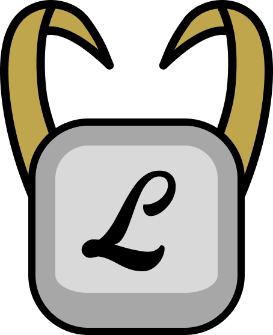

<div align="center">
  
  <h1>Lokey</h1>
</div>

<div align="center">

[](https://crates.io/crates/lokey)
[](https://docs.rs/lokey)
[](https://github.com/nn1ks/lokey#license)

</div>

<div align="center">
Lokey is an extensible keyboard firmware written in Rust.
</div>

---

#### Supported microcontrollers

- nRF52840
- RP2040

Note that the Atmega32u4 microcontroller (commonly used in Pro Micro controllers) is not supported and also won't be supported in the future because this firmware requires more flash memory and RAM than the microcontroller has.

#### Features

- USB Connectivity
- Bluetooth Low Energy (BLE)
- Split Keyboard Support
- Keymaps and Layers
- Predefined key behaviours (Hold Tap, Sticky, Toggle, ...)
- Custom key behaviours
- Custom keyboard features

See [issues tagged as enhancement](https://github.com/nn1ks/lokey/labels/enhancement) for planned and work-in-progress features.

#### Comparison to [ZMK](https://zmk.dev) and [QMK](https://qmk.fm)

The main benefit this firmware provides over ZMK and QMK is that it  is extensible, meaning you can

- write custom key behaviours
- implement custom keyboard features (e.g. status LEDs)
- and add support for microcontrollers

without having to fork the codebase.

ZMK and QMK do however have a lot more features out of the box and are obviously more battle-tested than this firmware.

## Test

Run this command to check the doc tests:

```
cargo test --doc --all-features -Zdoctest-xcompile
```

## License

Licensed under either of [Apache License, Version 2.0] or [MIT License] at your option.

[Apache License, Version 2.0]: https://github.com/nn1ks/lokey/blob/master/LICENSE-APACHE
[MIT License]: https://github.com/nn1ks/lokey/blob/master/LICENSE-MIT

Unless you explicitly state otherwise, any contribution intentionally submitted for inclusion in
this crate by you, as defined in the Apache-2.0 license, shall be dual licensed as above, without
any additional terms or conditions.
